# H.A.M.A.L
**H**ybrid **A**utomated **M**anagement **A**nd **L**ogging

<div align="center">


**Next-Gen Command Center for Managing Python Bots & Scripts**

</div>

---

## 📋 Overlay
**H.A.M.A.L** is a powerful desktop application designed to centralize the management of your Python automation scripts. Whether you run Telegram bots, data scrapers, or background workers, HAMAL provides a unified interface to control, monitor, and debug them all.

---

## ✨ Key Features

| Feature | Description |
|---------|-------------|
| 🚀 **Process Control** | Start, stop, and restart any script with a single click. |
| 📊 **Live Monitoring** | Real-time status tracking (Running, Stopped, Crashed). |
| 📝 **Log Streaming** | View live stdout/stderr logs for each process instantly. |
| 🛡️ **Process Isolation** | Each script runs independently; one crash won't affect others. |
| 💾 **Auto-Persistence** | Remembers your configuration and active scripts on restart. |
| 🎨 **Modern UI** | Sleek, dark-themed interface built with CustomTkinter. |

---

## 🔄 Workflow

```mermaid
graph LR
    User([👤 User]) -->|Interacts| UI[🖥️ HAMAL Interface]
    
    UI -->|Control| PM{⚙️ Process Manager}
    
    PM -->|Spawn| Worker1[🤖 Telegram Bot]
    PM -->|Spawn| Worker2[🕷️ Web Scraper]
    PM -->|Spawn| Worker3[📉 Data Analyzer]
    
    Worker1 -->|Logs/Status| PM
    Worker2 -->|Logs/Status| PM
    Worker3 -->|Logs/Status| PM
    
    PM -->|Update| UI
```



---

## 📸 Interface Preview

### Dashboard
The central hub where you can see all your active projects, their current status, and quick actions.

### Log Viewer
A dedicated terminal-like view for each bot, allowing you to debug issues in real-time without opening multiple console windows.

---

## 🏗️ Project Structure
```text
HAMAL/
├── 📂 src/
│   └── 📂 hamal/
│       ├── 📄 main.py          # Application Entry Point
│       ├── 📂 core/            # Logic (ProcessManager, Config)
│       ├── 📂 database/        # SQLite Models & Persistence
│       ├── 📂 ui/              # UI Components (Dialogs, Panels)
│       └── 📂 utils/           # Shared Utilities
├── 📂 data/                    # App Data (Logs, DB)
├── 📄 pyproject.toml           # Project Configuration
├── 📄 requirements.txt         # Dependencies
└── 📄 README.md                # You are here! 👋
```

---

## 🚀 Installation & Setup

### 1. Prerequisites
- **Python 3.10** or higher
- **Windows** OS

### 2. Clone the Repository
```bash
git clone https://github.com/Omer-Dahan/H.A.M.A.L.git
cd HAMAL
```

### 3. Install Dependencies
It is recommended to use a virtual environment.
```bash
# Create virtual environment
python -m venv .venv

# Activate it
.venv\Scripts\activate

# Install requirements
pip install -r requirements.txt
```

### 4. Run H.A.M.A.L
```bash
python -m hamal.main
```
_Alternatively, use the provided `run.bat` script._

---

## 🛡️ License
This project is licensed under the **MIT License**. Feel free to use and modify it for your own needs.

---

<div align="center">

**Made with ❤️ by Omer**

</div>
